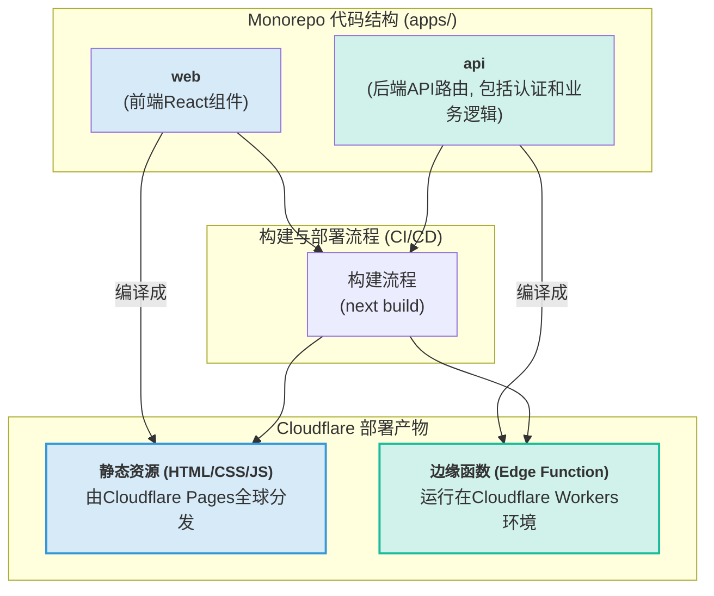
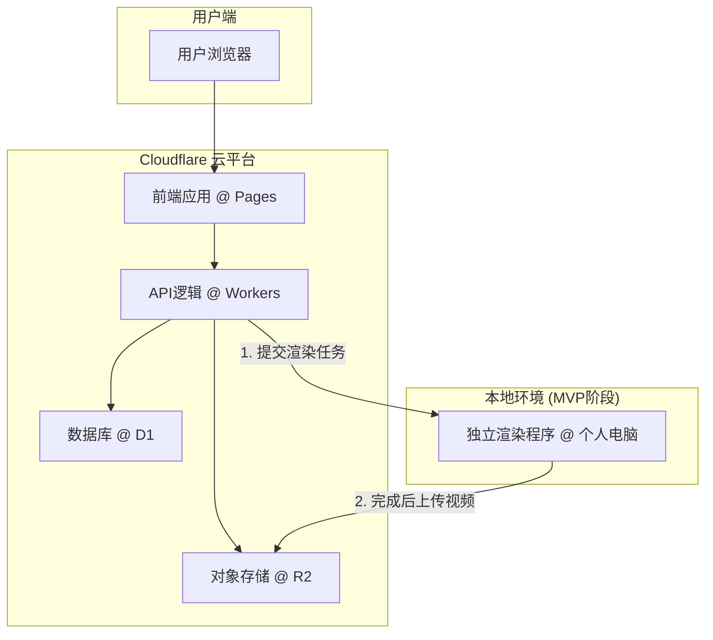
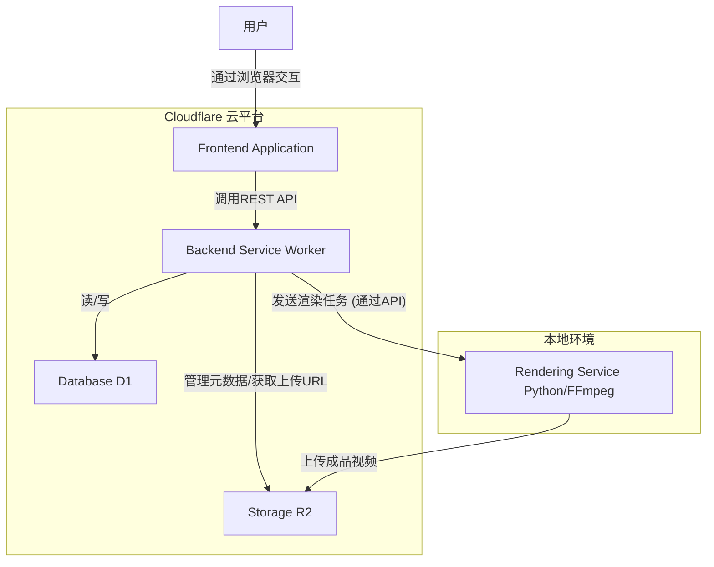
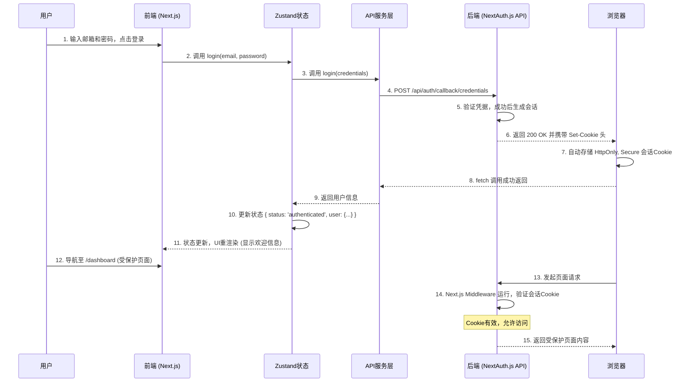
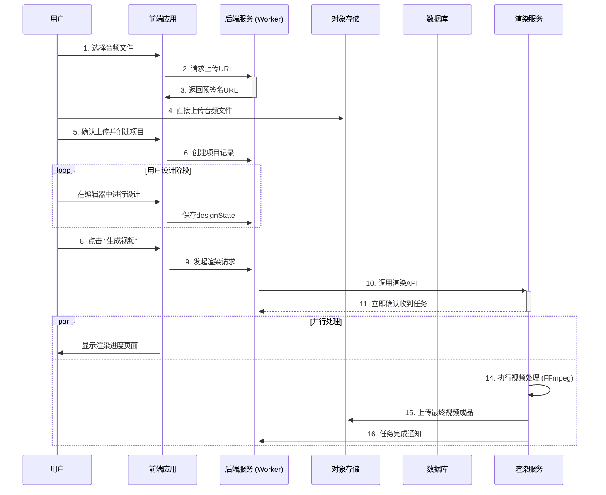
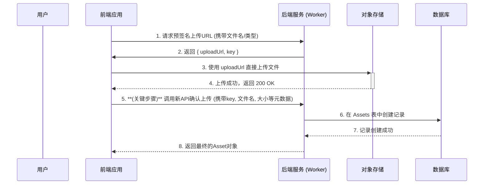
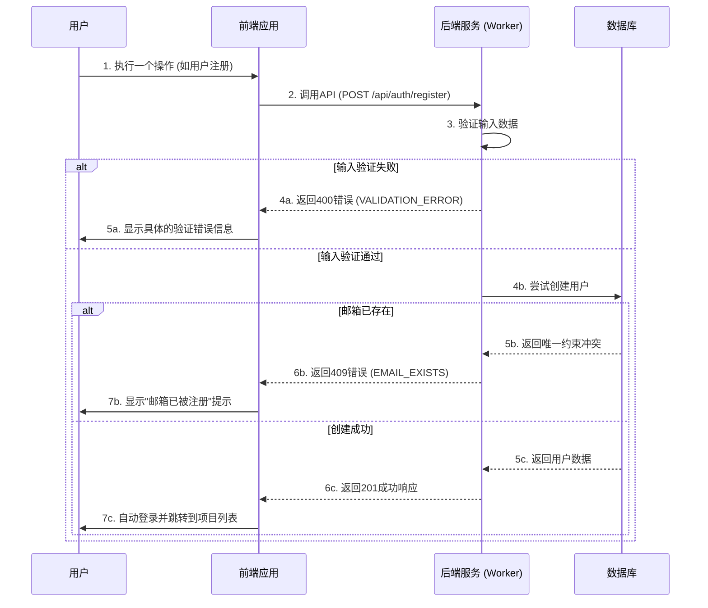

# **全栈架构文档 (Fullstack Architecture Document) - v2.5 (最终施工手册)**

## **第一部分：简介 (Introduction)**

本文档概述了"智能化在线视频创作平台"的完整全栈架构，包括后端系统、前端实现以及它们之间的集成。它将作为AI驱动开发工作的唯一技术真实来源，确保整个技术栈的一致性。这份文档不仅定义了“什么”，更定义了“如何做”，为核心功能提供了明确的、可复用的实现模式。

* **启动模板:** 决定使用社区推荐的"Cloudflare Pages + Workers入门模板"以加速开发。

### **变更日志 (Change Log)**

| 日期         | 版本  | 描述                                                          | 作者           |
|:---------- |:--- |:----------------------------------------------------------- |:------------ |
| 2025年8月1日  | 2.5 | **最终定稿版**：增加本地渲染器设计初衷说明、补全R2上传确认流程、并明确密码哈希执行地点。             | Winston, 架构师 |
| 2025年8月1日  | 2.3 | **最终版**：增加架构模式澄清图，提供访问D1/R2的关键代码模式，明确演进路径，并补充异步任务处理和安全下载模式。 | Winston, 架构师 |
| 2025年8月1日  | 2.2 | 修正了数据库访问的认证描述，明确了公共端点的例外情况。                                 | Winston, 架构师 |
| 2025年8月1日  | 2.1 | 增加架构模式澄清图，提供访问D1/R2的关键代码模式，明确演进路径。                          | Winston, 架构师 |
| 2025年8月1日  | 2.0 | **重大升级**：深化核心工作流，增加模式驱动的实现指南，为认证流程提供详细代码模式。                 | Winston, 架构师 |
| 2025年7月30日 | 1.0 | 创建初始架构文档草稿                                                  | Winston, 架构师 |

-----

## **第二部分：高层架构 (High Level Architecture)**

### **技术摘要 (Technical Summary)**

本项目将构建为一个全栈、解耦的Web应用。前端和核心业务逻辑将作为无服务器（Serverless）应用部署在Cloudflare生态系统上，以实现极致的性能和成本效益。 资源密集型的视频渲染任务在MVP阶段将被一个独立的本地应用程序处理，未来可平滑迁移至云端。 整体架构优先考虑的是低成本启动、快速迭代和未来的可扩展性。

### **架构模式澄清：一体化的后端 (Architectural Pattern Clarification: The Integrated Backend)**

为了消除任何可能的歧义，必须明确：在此架构中，**“Next.js后端”和“Worker服务”并非两个独立的服务，而是同一个实体的不同描述。** 我们只有一个后端逻辑层，其代码存在于Next.js的API路由中，并在部署后运行在Cloudflare Workers的环境上。这种一体化设计是实现低延迟、高安全性和简化运维的关键。

### **代码与部署的逻辑关系图 (Logical Diagram of Code and Deployment)**



### **高层概览 (High Level Overview)**

* **架构风格:** 解耦的服务化架构。
* **代码仓库:** 单一代码仓库 (Monorepo)。
* **核心流程:** 用户通过部署在Cloudflare Pages上的前端应用进行所有交互和设计。 当用户提交"生成视频"任务时，请求被Cloudflare Worker接收，并将一个任务描述（包含设计方案和资源链接）传递给独立的本地渲染程序。 渲染程序完成后，将成品视频上传回Cloudflare R2存储，并通知用户。

### **关于本地渲染器的说明 (Note on the Local Renderer)**

在MVP阶段，将视频渲染任务明确地从云端分离到一个独立的本地应用程序，是一个**有意的、战略性的架构决策**。

* **设计初衷:** 视频渲染是资源密集型任务，在云端执行成本高昂。为了严格遵守《项目简报》中“预算极为有限”的核心约束，我们通过此方式将最昂贵的计算部分移至线下，实现MVP阶段的**零渲染成本**。
* **固有局限性:** 这种模式**不具备扩展性**，存在单点故障风险（本地电脑必须在线），且处理能力有限。它仅作为一种临时的、用于验证核心产品价值的MVP方案。未来的演进路径（见第二十二部分）已规划了向云端渲染的迁移。

### **高层项目图 (High Level Project Diagram)**



### **架构与设计模式 (Architectural and Design Patterns)**

* **无服务器架构 (Serverless Architecture):** 充分利用Cloudflare Pages和Workers，避免管理服务器，按需付费，完美契合我们低成本启动的约束。
* **渲染器解耦 (Decoupled Renderer):** 将UI与渲染分离，确保了用户界面的高性能和响应速度，即使在渲染任务繁重时也不会受影响。
* **单一代码仓库 (Monorepo):** 简化了前端、后端Worker以及未来可能共享的代码库之间的类型定义和依赖管理。

-----

## **第三部分：技术栈 (Tech Stack)**

### **技术栈选型表 (Web Services)**

| 类别        | 技术                     | 版本     | 目的与理由                                                     |
|:--------- |:---------------------- |:------ |:--------------------------------------------------------- |
| **前端语言**  | TypeScript             | \~5.4  | 为项目提供类型安全，提升代码质量和可维护性。                                    |
| **前端框架**  | Next.js (React)        | \~14.2 | 业界领先的React框架，提供卓越的性能、开发体验和生态，与Cloudflare Pages完美集成。       |
| **UI组件库** | Headless UI / Radix UI | 最新     | 采用无头组件库，以获取无障碍且功能完备的组件逻辑，同时完全自由地控制视觉样式。                   |
| **CSS框架** | Tailwind CSS           | \~3.4  | 极大提升了UI开发效率，与无头组件库是最佳搭档，便于快速构建自定义界面。                      |
| **状态管理**  | Zustand / Jotai        | 最新     | 轻量级的状态管理库，相比Redux更简洁，足够支撑MVP并能扩展至复杂应用。                    |
| **后端语言**  | TypeScript             | \~5.4  | 与前端保持一致，便于在Monorepo中共享代码和类型，降低团队心智负担。                     |
| **后端运行时** | Cloudflare Workers     | 最新     | 核心技术约束，提供全球分布、高性能的Serverless计算环境。                         |
| **API风格** | REST / RPC via Fetch   | -      | 简单、成熟、无状态，完全满足MVP的API通信需求。                                |
| **数据库**   | Cloudflare D1          | 最新     | 与Workers生态系统无缝集成，提供Serverless SQL能力，且有免费套餐。               |
| **文件存储**  | Cloudflare R2          | 最新     | S3兼容，与Workers集成良好，提供极具成本效益的对象存储，适合存放用户上传的音频和生成的视频。        |
| **身份验证**  | Auth.js (NextAuth)     | \~5.0  | 开源、安全的身份验证库，轻松实现邮箱/密码和Google登录，与Next.js和Serverless环境兼容良好。 |
| **测试框架**  | Vitest                 | \~1.5  | 现代、快速的单元/集成测试框架，可同时用于测试前端React组件和后端Worker逻辑。              |
| **E2E测试** | Playwright             | \~1.44 | 提供可靠、快速的端到端测试能力，确保关键用户流程的正确性。                             |
| **CI/CD** | GitHub Actions         | -      | 与代码仓库无缝集成，拥有强大的免费额度，足以满足MVP的自动化构建和部署需求。                   |

### **技术栈选型表 (独立渲染程序)**

| 类别       | 技术                | 目的与理由                                                     |
|:-------- |:----------------- |:--------------------------------------------------------- |
| **语言**   | Python (\~3.11)   | 拥有强大的媒体处理和自动化脚本库，是此类任务的理想选择。                              |
| **核心依赖** | FFmpeg (二进制)      | 视频处理的行业标准工具，用于执行所有核心的视频合成、编码任务。                           |
| **图像处理** | Pillow            | 用于处理用户上传的图片素材，如缩放、裁剪和合成。                                  |
| **任务接收** | Flask (轻量级API服务器) | 运行一个简单的本地API端点来接收来自Cloudflare Worker的渲染任务。将通过内网穿透技术暴露给云端。 |

-----

## **第四部分：数据模型 (Data Models)**

### **1. User (用户模型)**

* **目的:** 存储用户账户信息，用于身份验证和项目关联。
* **TypeScript Interface**
  
  ```typescript
  // In packages/shared/types/user.ts
  export interface User {
    id: string;
    email: string;
    name?: string;
    passwordHash?: string;
    image?: string; // For Google profile picture
    createdAt: Date;
  }
  ```

### **2. Project (项目模型)**

* **目的:** 代表一个独立的视频创作项目，是连接用户、素材和设计方案的核心。
* **TypeScript Interface**
  
  ```typescript
  // In packages/shared/types/project.ts
  export interface Project {
    id: string;
    userId: string;
    title: string;
    status: 'draft' | 'rendering' | 'complete' | 'failed';
    audioAssetId: string;
    videoAssetId?: string;
    designState: Record<string, any>; // Represents the JSON state of the editor
    createdAt: Date;
    updatedAt: Date;
  }
  ```

### **3. Asset (素材模型)**

* **目的:** 统一管理用户上传的所有媒体文件（音频、图片）以及系统生成的视频文件。
* **TypeScript Interface**
  
  ```typescript
  // In packages/shared/types/asset.ts
  export interface Asset {
    id: string;
    userId: string;
    storageUrl: string;
    fileName: string;
    fileType: 'audio' | 'image' | 'video';
    fileSize: number;
    createdAt: Date;
  }
  ```

-----

## **第五部分：API规范 (API Specification)**

```yaml
openapi: 3.0.1
info:
  title: "播客视频化项目 API"
  version: "1.0.0"
  description: "用于驱动播客视频化项目前端应用的核心API。"
servers:
  - url: "/api"
paths:
  # 用户认证相关端点
  /auth/register:
    post:
      summary: "用户注册"
      description: "创建新用户账户"
      requestBody:
        required: true
        content:
          application/json:
            schema:
              type: object
              required:
                - email
                - password
                - name
              properties:
                email:
                  type: string
                  format: email
                  description: "用户邮箱地址"
                  example: "user@example.com"
                password:
                  type: string
                  minLength: 8
                  description: "用户密码，至少8位字符"
                  example: "SecurePass123!"
                name:
                  type: string
                  minLength: 2
                  maxLength: 50
                  description: "用户显示名称"
                  example: "张三"
      responses:
        '201':
          description: "注册成功"
          content:
            application/json:
              schema:
                type: object
                properties:
                  user:
                    $ref: '#/components/schemas/User'
                  message:
                    type: string
                    example: "注册成功"
        '400':
          description: "请求参数错误"
          content:
            application/json:
              schema:
                $ref: '#/components/schemas/ApiError'
        '409':
          description: "邮箱已存在"
          content:
            application/json:
              schema:
                $ref: '#/components/schemas/ApiError'

  /auth/login:
    post:
      summary: "用户登录"
      description: "用户身份验证"
      requestBody:
        required: true
        content:
          application/json:
            schema:
              type: object
              required:
                - email
                - password
              properties:
                email:
                  type: string
                  format: email
                  description: "用户邮箱地址"
                  example: "user@example.com"
                password:
                  type: string
                  description: "用户密码"
                  example: "SecurePass123!"
      responses:
        '200':
          description: "登录成功"
          headers:
            Set-Cookie:
              description: "设置认证会话Cookie"
              schema:
                type: string
                example: "auth-token=eyJhbGciOiJIUzI1NiIsInR5cCI6IkpXVCJ9...; HttpOnly; Secure; SameSite=Strict; Path=/; Max-Age=86400"
          content:
            application/json:
              schema:
                type: object
                properties:
                  user:
                    $ref: '#/components/schemas/User'
                  message:
                    type: string
                    example: "登录成功"
        '401':
          description: "认证失败"
          content:
            application/json:
              schema:
                $ref: '#/components/schemas/ApiError'

  /auth/logout:
    post:
      summary: "用户登出"
      description: "清除用户会话"
      security:
        - cookieAuth: []
      responses:
        '200':
          description: "登出成功"
          headers:
            Set-Cookie:
              description: "清除认证Cookie"
              schema:
                type: string
                example: "auth-token=; HttpOnly; Secure; SameSite=Strict; Path=/; Max-Age=0"
          content:
            application/json:
              schema:
                type: object
                properties:
                  message:
                    type: string
                    example: "登出成功"

  /auth/me:
    get:
      summary: "获取当前用户信息"
      description: "获取当前登录用户的详细信息"
      security:
        - cookieAuth: []
      responses:
        '200':
          description: "成功获取用户信息"
          content:
            application/json:
              schema:
                type: object
                properties:
                  user:
                    $ref: '#/components/schemas/User'
        '401':
          description: "未认证"
          content:
            application/json:
              schema:
                $ref: '#/components/schemas/ApiError'

  /assets/confirm-upload:
    post:
      summary: "确认文件上传成功并创建Asset记录"
      security:
        - cookieAuth: []
      requestBody:
        required: true
        content:
          application/json:
            schema:
              type: object
              properties:
                key:
                  type: string
                fileName:
                  type: string
                fileType:
                  type: string
                fileSize:
                  type: number
      responses:
        '201':
          description: "Asset记录创建成功"

  # 项目相关端点
  /projects:
    get:
      summary: "获取当前用户的所有项目"
      security:
        - cookieAuth: []
      responses:
        '200':
          description: "成功获取项目列表"
          content:
            application/json:
              schema:
                type: object
                properties:
                  projects:
                    type: array
                    items:
                      $ref: '#/components/schemas/Project'
        '401':
          description: "未认证"
          content:
            application/json:
              schema:
                $ref: '#/components/schemas/ApiError'

  /projects/{projectId}:
    get:
      summary: "获取单个项目的详情"
      security:
        - cookieAuth: []
      parameters:
        - name: projectId
          in: path
          required: true
          schema:
            type: string
            format: uuid
      responses:
        '200':
          description: "成功获取项目详情"
          content:
            application/json:
              schema:
                type: object
                properties:
                  project:
                    $ref: '#/components/schemas/Project'
        '401':
          description: "未认证"
          content:
            application/json:
              schema:
                $ref: '#/components/schemas/ApiError'
        '404':
          description: "项目不存在"
          content:
            application/json:
              schema:
                $ref: '#/components/schemas/ApiError'
    put:
      summary: "更新项目的设计方案"
      security:
        - cookieAuth: []
      parameters:
        - name: projectId
          in: path
          required: true
          schema:
            type: string
            format: uuid
      responses:
        '200':
          description: "项目更新成功"
        '401':
          description: "未认证"
          content:
            application/json:
              schema:
                $ref: '#/components/schemas/ApiError'

  /assets/upload-url:
    post:
      summary: "获取一个用于上传文件的预签名URL"
      security:
        - cookieAuth: []
      responses:
        '200':
          description: "成功获取上传URL"
        '401':
          description: "未认证"
          content:
            application/json:
              schema:
                $ref: '#/components/schemas/ApiError'

  /projects/{projectId}/render:
    post:
      summary: "触发一个视频渲染任务"
      security:
        - cookieAuth: []
      parameters:
        - name: projectId
          in: path
          required: true
          schema:
            type: string
            format: uuid
      responses:
        '202':
          description: "渲染任务已创建"
        '401':
          description: "未认证"
          content:
            application/json:
              schema:
                $ref: '#/components/schemas/ApiError'

components:
  securitySchemes:
    cookieAuth:
      type: apiKey
      in: cookie
      name: auth-token
      description: "HttpOnly认证Cookie"

  schemas:
    User:
      type: object
      properties:
        id:
          type: string
          format: uuid
          description: "用户唯一标识符"
        email:
          type: string
          format: email
          description: "用户邮箱地址"
        name:
          type: string
          description: "用户显示名称"
        createdAt:
          type: string
          format: date-time
          description: "账户创建时间"
        updatedAt:
          type: string
          format: date-time
          description: "账户最后更新时间"

    Project:
      type: object
      properties:
        id:
          type: string
          format: uuid
          description: "项目唯一标识符"
        name:
          type: string
          description: "项目名称"
        userId:
          type: string
          format: uuid
          description: "项目所有者ID"
        createdAt:
          type: string
          format: date-time
          description: "项目创建时间"
        updatedAt:
          type: string
          format: date-time
          description: "项目最后更新时间"

    ApiError:
      type: object
      properties:
        error:
          type: object
          properties:
            code:
              type: string
              description: "内部错误码"
              example: "VALIDATION_ERROR"
            message:
              type: string
              description: "用户友好的错误信息"
              example: "邮箱格式不正确"
            details:
              type: object
              description: "错误详细信息（可选）"
            timestamp:
              type: string
              format: date-time
              description: "错误发生时间"
            requestId:
              type: string
              description: "请求追踪ID"
```

-----

## **第六部分：组件 (Components)**

* **1. 前端应用 (Frontend Application):** 提供完整的用户界面，使用Next.js构建，部署在Cloudflare Pages。
* **2. 后端服务 (Backend Service):** 处理所有业务逻辑，使用Cloudflare Workers构建。
* **3. 渲染服务 (Rendering Service):** 接收渲染任务并使用FFmpeg生成视频，使用Python构建，MVP阶段在本地运行。
* **4. 数据库 (Database):** 持久化存储结构化数据，使用Cloudflare D1。
* **5. 对象存储 (Storage):** 存储所有媒体文件，使用Cloudflare R2。

### **组件交互图 (Component Diagram)**



-----

## **第七部分：外部API (External APIs)**

* **1. Google Authentication API:** 通过Auth.js库集成，用于实现用户的"通过Google登录"功能。
* **2. Cloudflare R2 Storage API:** 由渲染服务调用，用于将完成的视频文件上传回云端存储。

-----

## **第八部分：核心工作流 (Core Workflows)**

### **核心工作流 1 (深化): 用户认证与会话管理**

此流程详细描述了用户如何登录、系统如何管理会话，以及如何访问受保护的资源。



### **核心工作流 2: 创建并渲染一个新视频**



### **核心工作流 3: 云端到本地的异步任务处理模式**

**原则:** 云端Worker与本地渲染器之间的通信**必须**采用异步回调机制，严禁云端服务直接同步等待本地服务的处理结果。

**实现流程:**

1. **暴露本地服务:** 开发者**必须**使用`cloudflared tunnel`或`ngrok`等工具，为本地运行的渲染服务（Flask API）创建一个临时的、安全的公共URL。这个URL需要配置为后端的环境变量 `RENDERER_API_ENDPOINT`。
2. **任务分派 (Worker -\> Renderer):**
   * 当用户触发渲染时，云端Worker向 `RENDERER_API_ENDPOINT` 发送一个 `POST` 请求。
   * 请求体中包含任务ID、设计方案JSON、以及所有素材在R2中的路径。
   * 本地渲染服务收到请求后，**立即**将任务加入内部队列，并返回`202 Accepted`响应，表示“任务已收到，正在排队处理”。云端Worker的本次请求生命周期至此结束。
3. **任务回调 (Renderer -\> Worker):**
   * 本地渲染器在后台完成视频处理和上传后，**必须**向云端Worker的一个专用回调API（例如 `/api/projects/render-callback`）发起一个`POST`请求。
   * 该请求需要携带任务ID、最终状态（成功/失败）以及（如果成功）生成的视频在R2中的路径。
   * 这个回调API需要一个内部密钥进行保护，防止被恶意调用。
   * 云端Worker收到回调后，更新数据库中对应项目的状态。

### **核心工作流 4: 完整的文件上传与确认流程**



-----

## **第九部分：数据库结构 (Database Schema)**

```sql
-- Users Table: 存储所有用户的信息
CREATE TABLE Users (
    id TEXT PRIMARY KEY,
    email TEXT NOT NULL UNIQUE,
    name TEXT,
    password_hash TEXT,
    google_id TEXT UNIQUE,
    created_at TEXT NOT NULL DEFAULT CURRENT_TIMESTAMP
);

-- Assets Table: 存储所有媒体素材的元数据
CREATE TABLE Assets (
    id TEXT PRIMARY KEY,
    user_id TEXT NOT NULL,
    storage_url TEXT NOT NULL, -- This will be the 'key' of the object in R2
    file_name TEXT NOT NULL,
    file_type TEXT NOT NULL CHECK(file_type IN ('audio', 'image', 'video')),
    file_size REAL NOT NULL,
    created_at TEXT NOT NULL DEFAULT CURRENT_TIMESTAMP,
    FOREIGN KEY (user_id) REFERENCES Users(id)
);

-- Projects Table: 存储所有视频项目的信息
CREATE TABLE Projects (
    id TEXT PRIMARY KEY,
    user_id TEXT NOT NULL,
    title TEXT NOT NULL,
    status TEXT NOT NULL CHECK(status IN ('draft', 'rendering', 'complete', 'failed')) DEFAULT 'draft',
    audio_asset_id TEXT NOT NULL,
    video_asset_id TEXT,
    design_state TEXT NOT NULL, -- Storing JSON as TEXT
    created_at TEXT NOT NULL DEFAULT CURRENT_TIMESTAMP,
    updated_at TEXT NOT NULL DEFAULT CURRENT_TIMESTAMP,
    FOREIGN KEY (user_id) REFERENCES Users(id),
    FOREIGN KEY (audio_asset_id) REFERENCES Assets(id),
    FOREIGN KEY (video_asset_id) REFERENCES Assets(id)
);

-- Indexes for performance optimization
CREATE INDEX idx_assets_user_id ON Assets(user_id);
CREATE INDEX idx_projects_user_id ON Projects(user_id);
```

-----

## **第十部分：数据与存储访问模式 (Data and Storage Access Patterns)**

**原则：默认安全，显式公开 (Principle: Secure by Default, Explicitly Public)**

默认情况下，所有访问D1数据库或R2存储的API路由都**必须**是受保护的，且需要通过 `getServerSession` 进行有效的用户会话验证。这是系统的核心安全基石。

**例外情况：** 只有少数明确定义的“公开端点”可以在未经身份验证的情况下访问。这些端点包括但不限于：

* **用户注册 (`/api/auth/register`)**
* **用户登录 (`/api/auth/login`)**
* 未来可能出现的公开API（例如，公开的模板展示）

即便如此，这些公开端点内部也**必须**实施最严格的输入验证、速率限制和错误处理，以防范安全风险。所有其他数据库操作，特别是在 `D1数据库访问模式` 中展示的读取用户特定数据的操作，都必须严格遵循身份验证流程。

### **10.1 D1数据库访问模式 (D1 Database Access Pattern)**

所有数据库操作必须在经过身份验证的API路由中进行，并通过Cloudflare运行时提供的`env`对象绑定来执行。

* **场景：** 获取当前登录用户的所有项目。

* **文件位置：** `apps/api/projects/route.ts` (示例)

* **关键代码：**
  
  ```typescript
  import { getServerSession } from "next-auth/next";
  import { authOptions } from "../auth/[...nextauth]";
  import { NextRequest, NextResponse } from "next/server";
  
  // 定义Cloudflare运行时注入的环境变量类型
  interface Env {
    DB: D1Database;
  }
  
  // 使用Next.js App Router的GET处理器
  export async function GET(req: NextRequest) {
    // 1. 从请求中安全地获取用户会话
    // Auth.js通过HttpOnly Cookie自动处理了认证
    const session = await getServerSession(authOptions);
  
    if (!session || !session.user?.id) {
      return NextResponse.json({ error: { code: 'UNAUTHORIZED', message: '请先登录。' } }, { status: 401 });
    }
  
    // 2. 从上下文获取D1数据库绑定
    const env = (req as any).ctx.env as Env;
  
    try {
      // 3. 必须使用预处理语句 (Prepared Statements) 来防止SQL注入
      const stmt = env.DB.prepare("SELECT * FROM Projects WHERE userId = ?1").bind(session.user.id);
      const { results } = await stmt.all();
  
      // 4. 返回查询结果
      return NextResponse.json({ projects: results });
  
    } catch (e) {
      console.error("D1 Query Failed:", e);
      return NextResponse.json({ error: { code: 'DATABASE_ERROR', message: '获取项目失败。' } }, { status: 500 });
    }
  }
  ```

### **10.2 R2存储上传模式 (R2 Storage Upload Pattern)**

文件上传**必须**采用“预签名URL”(Presigned URL) 模式，以确保安全和性能。后端仅负责授权，实际上传由客户端直接完成。

* **场景：** 为用户上传音频文件生成一个安全的上传链接。

* **文件位置：** `apps/api/assets/upload-url/route.ts` (示例)

* **关键代码：**
  
  ```typescript
  import { S3Client, PutObjectCommand } from "@aws-sdk/client-s3";
  import { getSignedUrl } from "@aws-sdk/s3-request-presigner";
  import { getServerSession } from "next-auth/next";
  import { authOptions } from "../../auth/[...nextauth]";
  import { NextRequest, NextResponse } from "next/server";
  import crypto from "crypto";
  
  // 定义Cloudflare运行时注入的环境变量类型
  interface Env {
    R2_BUCKET_NAME: string;
    R2_ACCOUNT_ID: string;
    R2_ACCESS_KEY_ID: string;
    R2_SECRET_ACCESS_KEY: string;
  }
  
  export async function POST(req: NextRequest) {
    const session = await getServerSession(authOptions);
    if (!session || !session.user?.id) {
      return NextResponse.json({ error: { code: 'UNAUTHORIZED', message: '请先登录。' } }, { status: 401 });
    }
  
    const { fileName, fileType } = await req.json();
    const env = (req as any).ctx.env as Env;
  
    // 1. 初始化S3客户端以与R2交互
    const s3 = new S3Client({
      region: "auto",
      endpoint: `https://${env.R2_ACCOUNT_ID}.r2.cloudflarestorage.com`,
      credentials: {
        accessKeyId: env.R2_ACCESS_KEY_ID,
        secretAccessKey: env.R2_SECRET_ACCESS_KEY,
      },
    });
  
    // 2. 生成一个唯一的、安全的文件名
    const uniqueKey = `${session.user.id}/${crypto.randomUUID()}-${fileName}`;
  
    // 3. 创建预签名URL命令
    const command = new PutObjectCommand({
      Bucket: env.R2_BUCKET_NAME,
      Key: uniqueKey,
      ContentType: fileType,
    });
  
    // 4. 生成URL，有效期为10分钟
    const uploadUrl = await getSignedUrl(s3, command, { expiresIn: 600 });
  
    return NextResponse.json({ uploadUrl, key: uniqueKey });
  }
  ```

### **10.3 R2上传确认模式 (R2 Upload Confirmation Pattern)**

**原则:** 在客户端使用预签名URL将文件上传到R2**之后**，**必须**调用一个专用的后端API来确认上传成功，并由后端在数据库中创建相应的`Asset`记录。

* **场景:** 前端成功将文件上传到R2后。
* **API端点:** `POST /api/assets/confirm-upload`
* **请求体:** `{ "key": string, "fileName": string, "fileType": string, "fileSize": number }`
* **后端逻辑:**
  1. 验证用户身份。
  2. 验证请求体中的数据。
  3. 在`Assets`表中插入一条新记录，其中`storage_url`字段的值即为`key`。
  4. 返回新创建的`Asset`对象。

### **10.4 R2安全下载模式 (R2 Secure Download Pattern)**

**原则:** R2存储桶中的所有用户生成内容**必须**保持私有。前端向用户提供文件访问的唯一方式是通过后端生成的、有时效性的“预签名下载URL”。

* **场景:** 用户在项目页面点击“下载视频”按钮。

* **关键代码 (`apps/api/assets/download-url/route.ts`):**
  
  ```typescript
  import { S3Client, GetObjectCommand } from "@aws-sdk/client-s3";
  import { getSignedUrl } from "@aws-sdk/s3-request-presigner";
  // ...其他引入与认证逻辑...
  
  export async function POST(req: NextRequest) {
    // ... 必须先进行用户身份和项目所有权验证 ...
    const { assetKey } = await req.json(); // assetKey是文件在R2中的路径
    const env = (req as any).ctx.env as Env;
  
    const s3 = new S3Client({ /* ...S3客户端配置... */ });
  
    const command = new GetObjectCommand({
      Bucket: env.R2_BUCKET_NAME,
      Key: assetKey,
    });
  
    // 生成一个有效期为5分钟的只读下载链接
    const downloadUrl = await getSignedUrl(s3, command, { expiresIn: 300 });
  
    return NextResponse.json({ downloadUrl });
  }
  ```

-----

## **第十一部分：前端架构 (Frontend Architecture)**

### **11.1 核心实现模式 (Core Implementation Patterns)**

为了确保代码的高度一致性和可维护性，所有`dev` Agent在实现核心功能时，**必须**遵循以下模式。

#### **11.1.1 状态管理模式 (State Management Pattern)**

使用Zustand提供一个全局的认证状态存储。

* **文件位置**: `apps/web/stores/authStore.ts`

* **代码模板**:
  
  ```typescript
  import { create } from 'zustand';
  import { User } from '@/packages/shared/types/user';
  import * as authService from '@/apps/web/services/authService';
  
  interface AuthState {
    user: User | null;
    status: 'loading' | 'authenticated' | 'unauthenticated';
    login: (credentials: authService.LoginCredentials) => Promise<void>;
    logout: () => Promise<void>;
    checkAuth: () => Promise<void>;
  }
  
  export const useAuthStore = create<AuthState>((set) => ({
    user: null,
    status: 'loading',
  
    login: async (credentials) => {
      try {
        const user = await authService.login(credentials);
        set({ user, status: 'authenticated' });
      } catch (error) {
        console.error("Login failed:", error);
        set({ user: null, status: 'unauthenticated' });
        throw error;
      }
    },
  
    logout: async () => {
      await authService.logout();
      set({ user: null, status: 'unauthenticated' });
    },
  
    checkAuth: async () => {
      try {
        const session = await authService.getMe();
        if (session && session.user) {
          set({ user: session.user as User, status: 'authenticated' });
        } else {
           set({ user: null, status: 'unauthenticated' });
        }
      } catch {
        set({ user: null, status: 'unauthenticated' });
      }
    },
  }));
  ```

#### **11.1.2 API服务层模式 (API Service Layer Pattern)**

所有与后端API的交互都必须通过服务层进行封装。

* **文件位置**: `apps/web/services/authService.ts`

* **代码模板**:
  
  ```typescript
  // Types would be imported from a shared package
  // For simplicity, defining inline here.
  export interface LoginCredentials {
    email: string;
    password?: string;
    provider?: 'google';
  }
  
  // A simplified representation of the session object
  interface Session {
    user: {
      name?: string | null;
      email?: string | null;
      image?: string | null;
    }
  }
  
  // Assume a global fetch client is configured to handle errors
  import { apiClient } from './apiClient';
  
  export const login = async (credentials: LoginCredentials): Promise<Session['user']> => {
      // This would typically use NextAuth's signIn function
      // For pattern demonstration, we show a direct API call
      const response = await apiClient.post('/auth/login', credentials);
      return response.user;
  };
  
  export const logout = async (): Promise<void> => {
      // Uses NextAuth's signOut
      await apiClient.post('/auth/logout');
  };
  
  export const getMe = async (): Promise<Session | null> => {
      // Uses NextAuth's getSession
      return await apiClient.get('/auth/me');
  };
  ```

#### **11.1.3 受保护路由模式 (Protected Route Pattern)**

使用Next.js Middleware来保护需要用户登录才能访问的页面。

* **文件位置**: `apps/web/middleware.ts`

* **代码模板**:
  
  ```typescript
  import { NextResponse } from 'next/server';
  import type { NextRequest } from 'next/server';
  
  // This is the modern approach using Next.js Middleware with Auth.js
  import { getToken } from 'next-auth/jwt';
  
  export async function middleware(req: NextRequest) {
    const token = await getToken({ req, secret: process.env.AUTH_SECRET });
  
    const { pathname } = req.nextUrl;
  
    // If the user is not authenticated and is trying to access a protected route,
    // redirect them to the login page.
    if (!token && pathname.startsWith('/dashboard')) {
      const loginUrl = new URL('/login', req.url);
      loginUrl.searchParams.set('callbackUrl', req.url);
      return NextResponse.redirect(loginUrl);
    }
  
    // If the user is authenticated and tries to access login/register,
    // redirect them to the dashboard.
    if (token && (pathname === '/login' || pathname === '/register')) {
      return NextResponse.redirect(new URL('/dashboard', req.url));
    }
  
    return NextResponse.next();
  }
  
  // See "Matching Paths" below to learn more
  export const config = {
    matcher: [
      '/dashboard/:path*',
      '/login',
      '/register',
    ],
  };
  ```

#### **11.1.4 认证信息传递模式 (Authenticated Request Pattern)**

**核心原则：** 我们的认证体系依赖于由后端设置的、符合安全标准的 `HttpOnly` Cookie。这意味着前端应用**无需也禁止**手动管理或在请求头（Request Headers）中附加任何Token（如 `Authorization: Bearer ...`）。

**前端 `dev` Agent 实施指南:**

1. **调用服务层:** 当需要请求一个受保护的后端API时（例如，获取用户项目列表），你只需像调用任何普通API一样调用相应的服务层函数（如 `projectService.getProjects()`）。
2. **浏览器自动处理:** 浏览器会自动将当前域名下的 `HttpOnly` 会话Cookie附加到你的`fetch`请求中。你不需要编写任何特殊代码来处理认证信息的附加。
3. **服务层封装:** `apiClient` 或服务层函数负责发起请求并处理响应，无需关心认证细节。

**后端 `dev` Agent 实施指南:**

1. **API路由保护:** 在你的后端API路由（Cloudflare Worker / Next.js API Route）中，你**必须**使用 `Auth.js` (NextAuth) 提供的服务端工具来获取和验证当前用户的会话。
2. **获取会话:** 通过从请求中解析出的Cookie，你可以安全地获取到用户信息。

-----

## **第十二部分：后端架构 (Backend Architecture)**

* **Worker服务架构:** **必须**使用 **Next.js 内置的、基于文件系统的API路由**来定义和管理所有API端点。业务逻辑与数据访问逻辑**必须**通过仓储模式 (Repository Pattern) 或类似的服务层进行隔离，以保持代码的整洁和可测试性。
* **认证与授权:** 使用`withAuth`中间件或在API路由处理器中通过`getServerSession`来保护需要登录才能访问的API端点。
* **渲染服务架构:** 采用异步任务工作者模式，通过Flask API接收任务，放入内部队列，由后台进程调用FFmpeg处理，并通过回调API通知Worker任务完成状态。

-----

## **第十三部分：统一的项目结构 (Unified Project Structure)**

```plaintext
podcast-video-app/
├── apps/
│   ├── web/        # 前端Next.js应用
│   ├── api/        # 后端Cloudflare Worker应用 (逻辑代码)
│   └── renderer/   # 独立视频渲染应用 (Python)
├── packages/
│   ├── shared/     # 前后端共享的代码 (特别是TypeScript类型)
│   └── config/     # 共享的配置文件 (ESLint, TypeScript)
├── docs/
├── package.json
└── turbo.json
```

#### **架构说明：逻辑分离与部署统一**
 
必须理解，`apps/web`和`apps/api`的目录分离是一种**代码组织上的逻辑分离**，旨在提升开发过程中的模块化和清晰度。在**部署时**，它们被Next.js的构建流程统一处理：

* **`apps/web`** 中的代码构成了用户浏览器下载的**客户端**。
* **`apps/api`** 中的代码则被编译为在**Cloudflare Workers**上运行的**服务端边缘函数**。
因此，它们在生产环境中共同构成了一个**单一、完整的、一体化的应用**，而不是两个需要通过公网进行通信的独立服务。

-----

## **第十四部分：开发工作流 (Development Workflow)**

### **本地开发设置 (Local Development Setup)**

* **先决条件:** 在开始之前，请确保您的开发环境中已安装以下工具：
  
  ```bash
  # 软件:
  - Node.js (~20.x)
  - pnpm (~9.x)
  - Python (~3.11)
  - FFmpeg
  - (推荐) 内网穿透工具，如 ngrok 或 cloudflared tunnel
  - Cloudflare CLI (wrangler)
  ```

* **初次安装:**
  
  ```bash
  git clone [repository_url]
  cd podcast-video-app
  pnpm install
  pip install -r apps/renderer/requirements.txt
  cp .env.example .env
  # ... 然后根据.env.example的指示，填写所有必需的密钥和URL
  ```

* **开发命令:**
  
  ```bash
  # 启动所有Web服务 (前端 + 后端Worker)
  pnpm dev
  # 独立启动Python渲染服务
  python apps/renderer/api.py
  ```

### **环境变量配置 (Environment Configuration)**

* **后端Worker (`apps/api/.env`):**
  * `DATABASE_URL`: Cloudflare D1的连接信息。
  * `R2_BUCKET_NAME`: Cloudflare R2存储桶名称。
  * `GOOGLE_CLIENT_ID` / `SECRET`: Google登录凭证。
  * `AUTH_SECRET`: Auth.js的会话密钥。
  * `RENDERER_API_ENDPOINT`: 暴露给公网的本地渲染服务URL。
* **渲染服务 (`apps/renderer/.env`):**
  * `R2_ACCOUNT_ID` / `ACCESS_KEY_ID` / `SECRET_ACCESS_KEY`: R2的API访问凭证。
  * `CALLBACK_API_ENDPOINT`: 用于状态回传的后端Worker URL。

-----

## **第十五部分：部署架构 (Deployment Architecture)**

### **部署策略 (Deployment Strategy)**

* **前端应用 (`apps/web`):** 通过CI/CD流程，自动部署到 **Cloudflare Pages**。
* **后端服务 (`apps/api`):** 通过CI/CD流程，使用`wrangler`自动部署到 **Cloudflare Workers**。
* **渲染服务 (`apps/renderer`):** MVP阶段**不进行云端部署**，在本地手动运行。

### **CI/CD 流水线 (CI/CD Pipeline)**

我们将使用**GitHub Actions**。流水线将在代码合并到`main`分支时触发，依次执行测试、构建和部署作业。

### **环境 (Environments)**

| 环境          | 目的                                    |
|:----------- |:------------------------------------- |
| Development | 本地开发与测试                               |
| Staging     | 合并到生产前的预览和测试 (利用Cloudflare Pages分支预览) |
| Production  | 线上生产环境                                |

-----

## **第十六部分：安全与性能 (Security and Performance)**

### **安全要求 (Security Requirements)**

**前端安全:**

- 配置严格的**内容安全策略 (CSP)**
- 所有用户生成的内容在渲染时都必须经过严格的净化处理
- 认证状态通过HttpOnly Cookie管理，前端无法直接访问token

**后端安全:**

- 所有API的输入数据都必须经过严格的**校验**
- 对关键API端点实施**速率限制**
- 配置严格的**CORS策略**
- 实施SQL注入防护和XSS防护

**认证安全:**

- 使用安全的、`HttpOnly`的会话Cookie
- 所有密钥**必须**通过环境变量管理，严禁硬编码
- 实施以下密码安全策略：

#### **密码哈希和存储策略**

**强制性规定：**

* **密码哈希必须且只能在后端执行。** 在处理用户注册（`/api/auth/register`）或密码修改的API路由中，接收到用户的明文密码后，**必须立即**使用`bcrypt`进行哈希，然后才能将哈希后的值存入数据库。**严禁**在前端对密码进行任何形式的哈希处理。

**密码要求:**

- 最小长度：8个字符
- 必须包含：至少一个大写字母、一个小写字母、一个数字
- 推荐包含特殊字符
- 禁止使用常见弱密码（如"password123"等）

**密码哈希算法:**

- 使用 **bcrypt** 算法进行密码哈希
- 最小成本因子（cost factor）：**12**
- 每个密码使用唯一的随机盐值
- 绝不存储明文密码

### **性能优化 (Performance Optimization)**

**前端性能:**

- 采用**代码分割**、**懒加载**策略
- 充分利用Cloudflare Pages的全球**CDN缓存**
- 实施资源预加载和关键资源优先级
- 优化图片和静态资源压缩

**后端性能:**

- API的目标响应时间（P95）应在**200毫秒**以内
- 数据库查询**必须**使用索引
- 实施查询结果缓存策略
- 对频繁访问的数据实施Redis缓存

-----

## **第十七部分：测试策略 (Testing Strategy)**

### **测试金字塔 (Testing Pyramid)**

遵循标准的"测试金字塔"模型，以大量的单元测试为基础，辅以中等数量的集成测试和少量关键流程的E2E测试。

### **测试组织 (Test Organization)**

* **单元/集成测试:** 测试文件将与被测试的组件或服务放在一起（co-location）。
* **端到端(E2E)测试:** 存放在代码仓库根目录下的一个独立的 `e2e/` 目录中。
* **测试示例:** 为前端组件、后端API和E2E测试提供了基于`Vitest`和`Playwright`的脚手架代码示例。

-----

## **第十八部分：编码规范 (Coding Standards)**

### **关键规则 (Critical Rules)**

* **1. 共享类型定义:** 所有在前后端共享的数据结构类型**必须**在`packages/shared`中统一定义并导入使用。
* **2. API调用封装:** 前端**必须**通过统一的API客户端服务层来调用后端API。
* **3. 环境变量隔离:** 应用代码中**严禁**直接访问`process.env`。所有密钥和配置**必须**通过Cloudflare Worker运行时注入的`env`对象来访问。
* **4. 统一错误处理:** 所有API路由**必须**使用统一的错误处理中间件，并使用`AppError`类来抛出可预期的业务逻辑错误。

### **命名约定 (Naming Conventions)**

| 元素     | 约定                | 示例              |
|:------ |:----------------- |:--------------- |
| 组件/类型  | PascalCase        | `UserProfile`   |
| Hook文件 | camelCase (use\*) | `useAuth.ts`    |
| 数据库表   | snake\_case       | `user_profiles` |

-----

## **第十九部分：错误处理策略 (Error Handling Strategy)**

### **错误流程 (Error Flow)**



### **标准化错误响应格式 (Standardized Error Response Format)**

所有失败的API请求都将返回以下结构的JSON响应体：

```typescript
interface ApiError {
  error: {
    code: string;           // 标准化错误码
    message: string;        // 用户友好的错误信息
    timestamp: string;      // ISO 8601格式的错误时间戳
    requestId: string;      // 用于追踪日志的唯一请求ID
  };
}
```

-----

## **第二十部分：监控与可观测性 (Monitoring and Observability)**

### **监控技术栈 (Monitoring Stack)**

MVP阶段，我们将优先利用平台自带的免费且强大的监控工具。

* **前端监控:**
  * **性能与分析:** 利用 **Cloudflare Web Analytics** 来收集核心的用户行为和性能指标（如Core Web Vitals）。
  * **错误追踪:** 集成一个轻量级的第三方服务，如 **Sentry** 的免费套餐，来捕获和报告前端发生的JavaScript错误。
* **后端监控 (Worker):**
  * **核心指标:** 主要依赖 **Cloudflare Workers的内置分析** 来监控API请求率、错误率、CPU执行时间和冷启动情况。
  * **日志:** 详细的错误日志将被打印到Cloudflare控制台，以便于实时调试。
* **渲染服务监控:**
  * **MVP阶段:** 通过**手动查看本地程序的命令行日志**来进行监控。
  * **未来:** 当迁移到云端后，将集成云平台自带的监控服务（如AWS CloudWatch或Google Cloud Logging）。

### **关键指标 (Key Metrics)**

我们将重点关注以下几类关键指标：

* **前端指标:**
  * Core Web Vitals (LCP, INP, CLS): 衡量用户感知的页面加载和交互性能。
  * JS 错误率: 衡量前端代码的稳定性。
  * API 请求延迟: 从客户端视角衡量的后端响应速度。
* **后端指标 (Worker):**
  * 请求总数 & 错误率: API的整体健康度和可靠性。
  * CPU 执行时间: 监控性能热点和潜在的成本驱动因素。
* **渲染服务指标:**
  * 任务队列长度: (未来迁移至云端后) 衡量渲染任务积压情况的关键指标。
  * 平均渲染时间: 每个视频的平均处理耗时。
  * 渲染成功/失败率: 衡量渲染服务的可靠性。

-----

## **第二十一部分：清单检查结果报告 (Checklist Results Report)**

* **最终决定:** **准备就绪 (READY FOR DEVELOPMENT)**。

-----

## **第二十二部分：架构演进路径 (Architecture Evolution Path)**

当前的一体化架构是为实现MVP目标而精心选择的。为了确保未来的可扩展性，我们预设了以下演进路径：

1. **第一阶段 (当前): 一体化模式。**
   
   * **策略:** 所有后端逻辑（认证、项目管理等）均作为Next.js API路由实现，并运行在Workers上。
   * **优势:** 开发效率最高，性能最好，成本最低，完美契合MVP需求。

2. **第二阶段 (按需分离): 功能性微服务。**
   
   * **触发条件:** 当某个特定功能（例如，我们已经分离的“视频渲染”，或未来可能出现的复杂算法）变得计算密集且需要独立于主应用进行扩展时。
   * **策略:** 将该特定功能剥离为一个独立的Worker服务，主应用通过HTTP调用它。
   * **优势:** 在不重构整个系统的前提下，实现对关键瓶颈的精准优化。

3. **第三阶段 (当有新客户端时): 核心服务层。**
   
   * **触发条件:** 当我们需要支持一个全新的客户端，例如原生移动App (iOS/Android)时。
   * **策略:** 将所有共享的业务逻辑（用户、项目等）重构为一个独立的核心后端服务。此时，Next.js后端将演变为一个纯粹的BFF，只负责服务Web端的数据聚合与格式化。
   * **优势:** 实现跨多端的核心逻辑复用，支持更复杂的生态系统。 