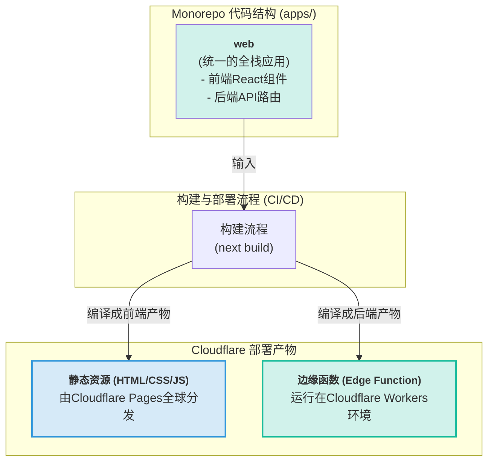
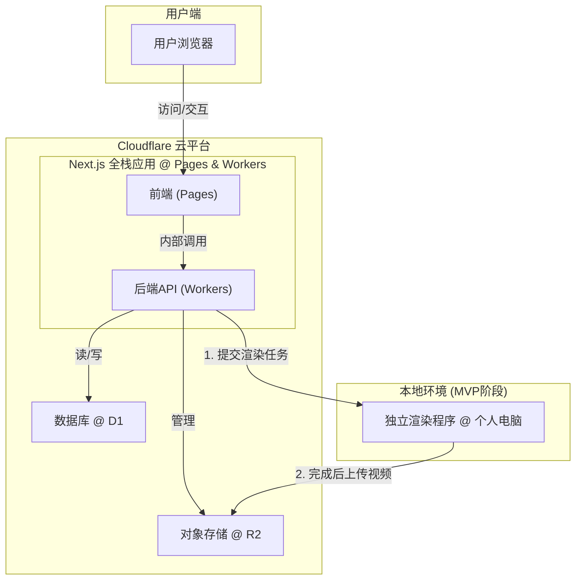

## **第二部分：高层架构 (High Level Architecture)**

### **技术摘要 (Technical Summary)**

本项目将构建为一个全栈、解耦的Web应用。前端和核心业务逻辑将作为无服务器（Serverless）应用部署在Cloudflare生态系统上，以实现极致的性能和成本效益。 资源密集型的视频渲染任务在MVP阶段将被一个独立的本地应用程序处理，未来可平滑迁移至云端。 整体架构优先考虑的是低成本启动、快速迭代和未来的可扩展性。

### **架构模式澄清：一体化的后端 (Architectural Pattern Clarification: The Integrated Backend)**

为了消除任何可能的歧义，必须明确：在此架构中，**“Next.js后端”和“Worker服务”并非两个独立的服务，而是同一个实体的不同描述。** 我们只有一个后端逻辑层，其代码存在于Next.js的API路由中，并在部署后运行在Cloudflare Workers的环境上。这种一体化设计是实现低延迟、高安全性和简化运维的关键。

### **代码与部署的逻辑关系图 (Logical Diagram of Code and Deployment)**

### **高层概览 (High Level Overview)**

* **架构风格:** 解耦的服务化架构。
* **代码仓库:** 单一代码仓库 (Monorepo)。
* **核心流程:** 用户通过部署在Cloudflare Pages上的前端应用进行所有交互和设计。 当用户提交"生成视频"任务时，请求被Cloudflare Worker接收，并将一个任务描述（包含设计方案和资源链接）传递给独立的本地渲染程序。 渲染程序完成后，将成品视频上传回Cloudflare R2存储，并通知用户。

### **关于本地渲染器的说明 (Note on the Local Renderer)**

在MVP阶段，将视频渲染任务明确地从云端分离到一个独立的本地应用程序，是一个**有意的、战略性的架构决策**。

* **设计初衷:** 视频渲染是资源密集型任务，在云端执行成本高昂。为了严格遵守《项目简报》中“预算极为有限”的核心约束，我们通过此方式将最昂贵的计算部分移至线下，实现MVP阶段的**零渲染成本**。
* **固有局限性:** 这种模式**不具备扩展性**，存在单点故障风险（本地电脑必须在线），且处理能力有限。它仅作为一种临时的、用于验证核心产品价值的MVP方案。未来的演进路径（见第二十二部分）已规划了向云端渲染的迁移。

### **高层项目图 (High Level Project Diagram)**

### **架构与设计模式 (Architectural and Design Patterns)**

* **无服务器架构 (Serverless Architecture):** 充分利用Cloudflare Pages和Workers，避免管理服务器，按需付费，完美契合我们低成本启动的约束。
* **渲染器解耦 (Decoupled Renderer):** 将UI与渲染分离，确保了用户界面的高性能和响应速度，即使在渲染任务繁重时也不会受影响。
* **单一代码仓库 (Monorepo):** 简化了前端、后端Worker以及未来可能共享的代码库之间的类型定义和依赖管理。

***
