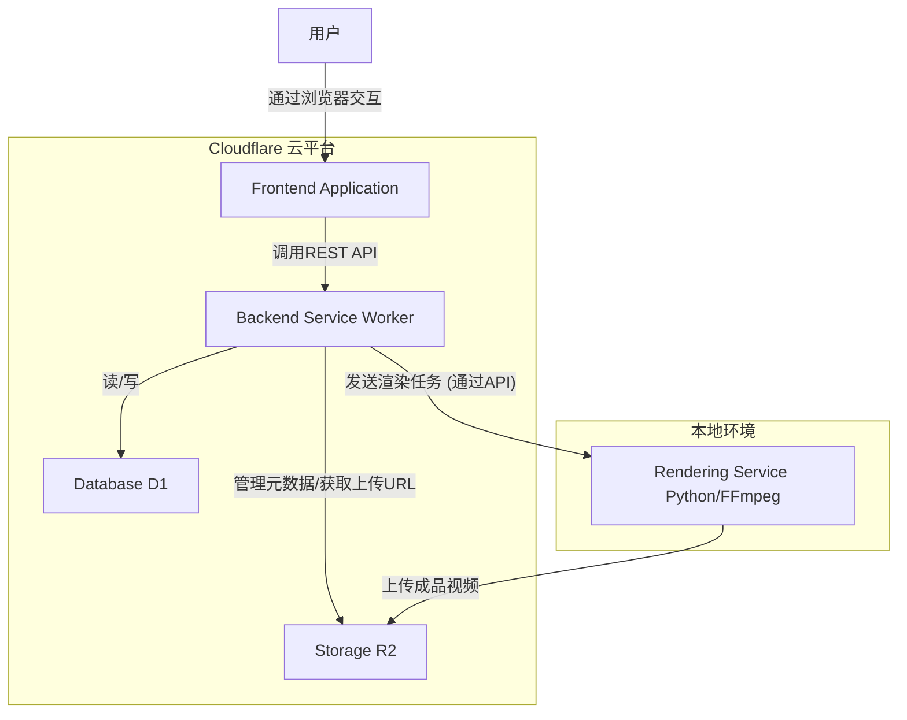

## **第六部分：组件 (Components)**

* **1. 前端应用 (Frontend Application):** 提供完整的用户界面，使用Next.js构建，部署在Cloudflare Pages。
* **2. 后端服务 (Backend Service):** 处理所有业务逻辑，使用Cloudflare Workers构建。
* **3. 渲染服务 (Rendering Service):** 接收渲染任务并使用FFmpeg生成视频，使用Python构建，MVP阶段在本地运行。
* **4. 数据库 (Database):** 持久化存储结构化数据，使用Cloudflare D1。
* **5. 对象存储 (Storage):** 存储所有媒体文件，使用Cloudflare R2。

### **组件交互图 (Component Diagram)**

