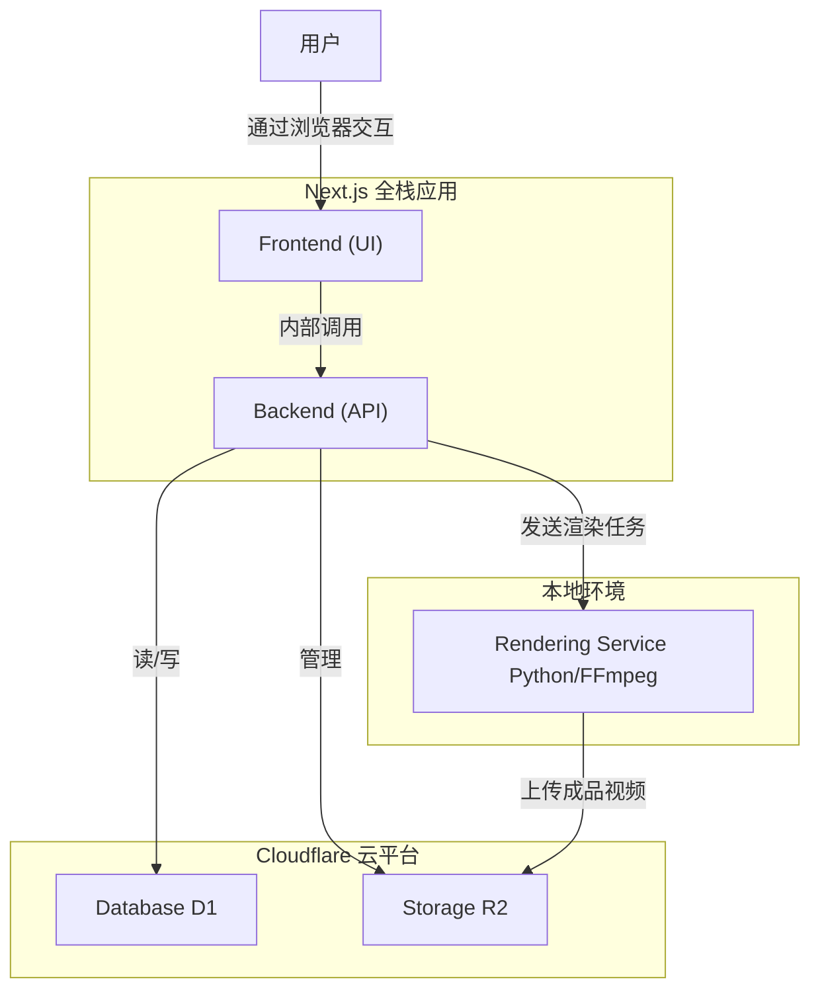

## **第六部分：组件 (Components)**

* **1. Next.js 全栈应用 (Next.js Full-Stack Application):** 这是系统的核心组件，作为一个统一的实体进行开发和部署。
  * **前端部分 (UI):** 提供完整的用户界面，使用Next.js的React组件构建，最终由Cloudflare Pages分发。
  * **后端部分 (API):** 处理所有业务逻辑，使用Next.js的API路由编写，最终在Cloudflare Workers上运行。
* **2. 渲染服务 (Rendering Service):** 接收渲染任务并使用FFmpeg生成视频，使用Python构建，MVP阶段在本地运行。
* **3. 数据库 (Database):** 持久化存储结构化数据，使用Cloudflare D1。
* **4. 对象存储 (Storage):** 存储所有媒体文件，使用Cloudflare R2。

### **组件交互图 (Component Diagram)**

***
