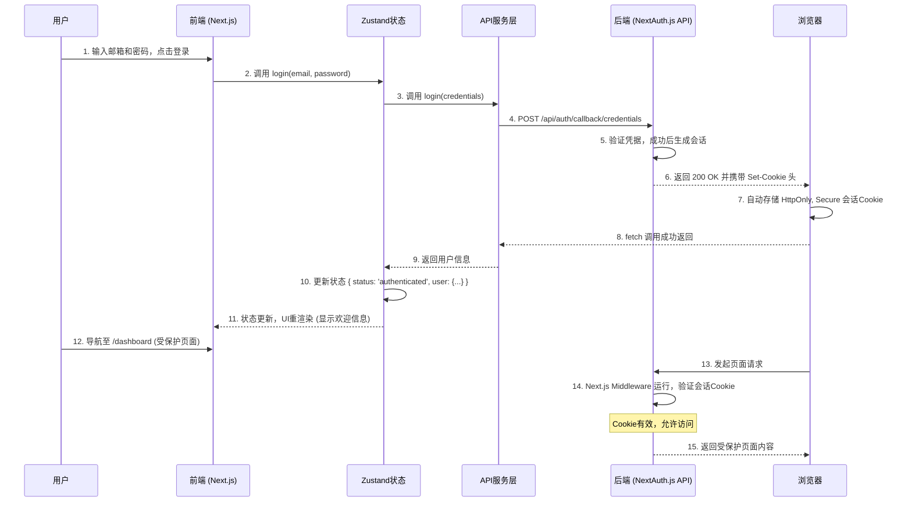
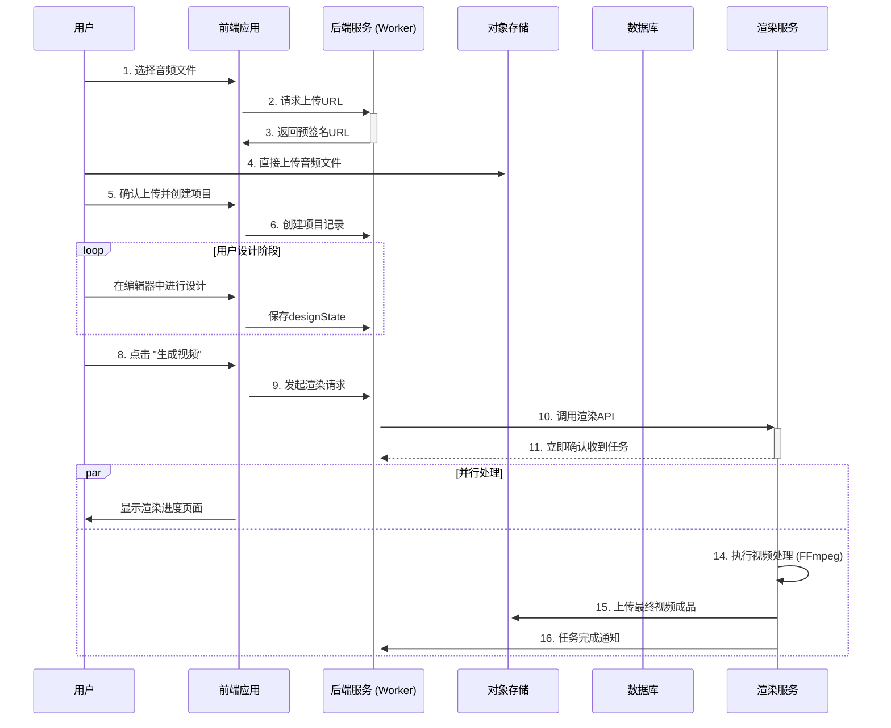
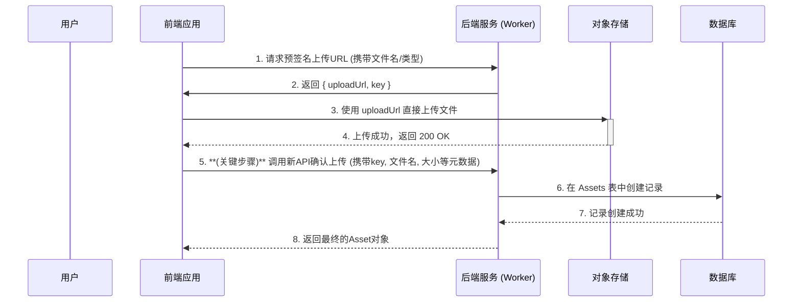

## **第八部分：核心工作流 (Core Workflows)**

### **核心工作流 1 (深化): 用户认证与会话管理**

此流程详细描述了用户如何登录、系统如何管理会话，以及如何访问受保护的资源。

### **核心工作流 2: 创建并渲染一个新视频**

### **核心工作流 3: 云端到本地的异步任务处理模式**

**原则:** 云端Worker与本地渲染器之间的通信**必须**采用异步回调机制，严禁云端服务直接同步等待本地服务的处理结果。

**实现流程:**

1. **暴露本地服务:** 开发者**必须**使用`cloudflared tunnel`或`ngrok`等工具，为本地运行的渲染服务（Flask API）创建一个临时的、安全的公共URL。这个URL需要配置为后端的环境变量 `RENDERER_API_ENDPOINT`。
2. **任务分派 (Worker -\> Renderer):**
   * 当用户触发渲染时，云端Worker向 `RENDERER_API_ENDPOINT` 发送一个 `POST` 请求。
   * 请求体中包含任务ID、设计方案JSON、以及所有素材在R2中的路径。
   * 本地渲染服务收到请求后，**立即**将任务加入内部队列，并返回`202 Accepted`响应，表示“任务已收到，正在排队处理”。云端Worker的本次请求生命周期至此结束。
3. **任务回调 (Renderer -\> Worker):**
   * 本地渲染器在后台完成视频处理和上传后，**必须**向云端Worker的一个专用回调API（例如 `/api/projects/render-callback`）发起一个`POST`请求。
   * 该请求需要携带任务ID、最终状态（成功/失败）以及（如果成功）生成的视频在R2中的路径。
   * 这个回调API需要一个内部密钥进行保护，防止被恶意调用。
   * 云端Worker收到回调后，更新数据库中对应项目的状态。

### **核心工作流 4: 完整的文件上传与确认流程**

