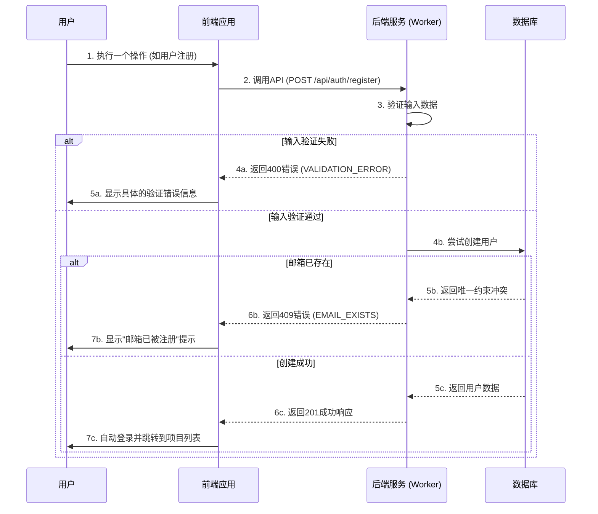

## **第十九部分：错误处理策略 (Error Handling Strategy)**

### **错误流程 (Error Flow)**



### **标准化错误响应格式 (Standardized Error Response Format)**

所有失败的API请求都将返回以下结构的JSON响应体：

```typescript
interface ApiError {
  error: {
    code: string;           // 标准化错误码
    message: string;        // 用户友好的错误信息
    timestamp: string;      // ISO 8601格式的错误时间戳
    requestId: string;      // 用于追踪日志的唯一请求ID
  };
}
```